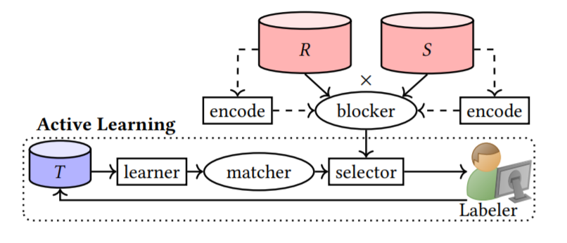
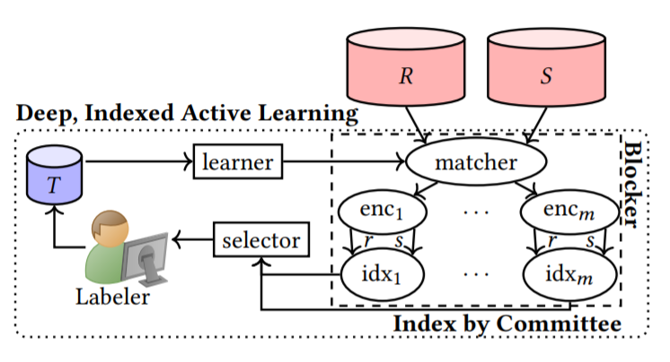

# DIAL

Implementation of

- Deep Indexed Active Learning for Matching Heterogeneous Entity Representations



Traditional methods for Active Learning Pairwise classification tasks follow a pipeline as described: 
In each iteration, the learning algorithm (learner) learns a matcher (shown in an ellipse which we use to denote model components) from labeled data 𝑇,
the labeled pairs collected from the (human) labeler so far, while the example selector (selector) chooses the most informative unlabeled
pairs to acquire labels for. After including the new labels into 𝑇, the process repeats until we learn a matcher of sufficient quality.



Our proposed integrated matcher-blocker combination and new AL workflow as shown. Compared to the previous diagram, the two most notable differences are 
1) the blocker (dashed box) is now part of the AL feedback loop, and 
2) the matcher is a component within the blocker. 
As base matcher, we use transformer-based pretrained language models (TPLM) which have recently led to excellent ER accuracies in the passive (non-AL) settings.

## Getting Started

### Environment
This code has been tested on a machine with 64 2.10GHz Intel Xeon Silver 4216 CPUs with 1007GB RAM and a single NVIDIA Titan Xp 12 GB GPU with CUDA 10.2 running Ubuntu 18.04

### Reproducing the Experiments

The first step is to get the data. We provide the data used in DeepMatcher experiments ([Link1](https://github.com/anhaidgroup/deepmatcher/blob/master/Datasets.md) [Link2](https://dbs.uni-leipzig.de/en/research/projects/object_matching/benchmark_datasets_for_entity_resolution) [Link3](https://sites.google.com/site/anhaidgroup/useful-stuff/data)) 
The multilingual data can be downloaded from [salesforce/localization-xml-mt](https://github.com/salesforce/localization-xml-mt)

```
cd MultiLingual
git clone https://github.com/salesforce/localization-xml-mt.git
```

Now create a virtual environment using conda

```
conda create -n DIAL_env
conda activate DIAL_env
conda install -y -c conda-forge -c pytorch pytorch==1.6 cudatoolkit=10.2
pip install faiss-cpu transformers scikit-learn pandas 
```

Use run_expts.sh to replicate experiments from the paper. Example 

```
bash run_expts.sh DIAL amazon_google_exp 
```

To evaluate on Test, run

```
bash run_eval.sh Eval-Test DIAL amazon_google_exp 
```
and to evaluated on All Pairs, run
```
bash run_eval.sh Eval-AllPairs DIAL amazon_google_exp 
```

Currently supports : Walmart-Amazon, Amazon-Google, DBLP-ACM, DLBP-Google Scholar, Abt-Buy

To run experiments with the multilingual dataset, 

```
cd MultiLingual
bash run_multilingual_expts.sh DIAL-Multilingual
```

References:
1. https://github.com/megagonlabs/ditto
2. https://github.com/brunnurs/entity-matching-transformer
3. https://github.com/anhaidgroup/deepmatcher
4. https://github.com/JordanAsh/badge
